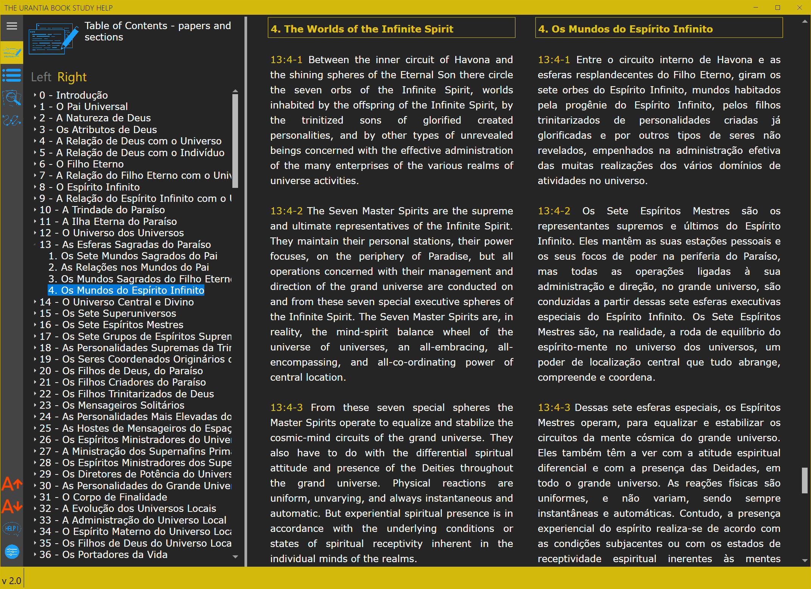
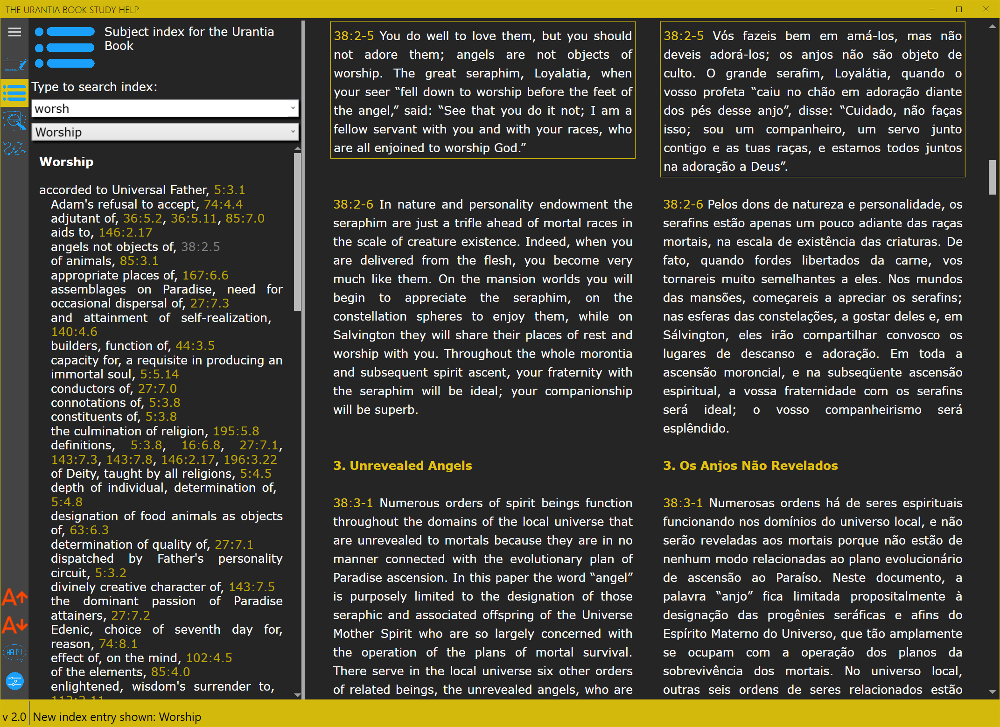
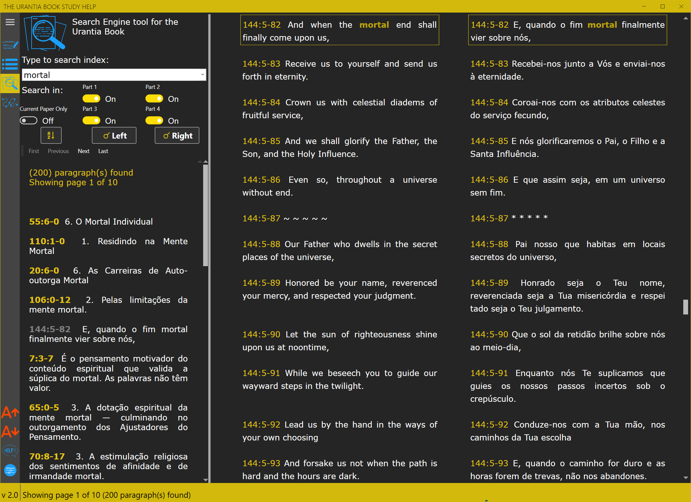
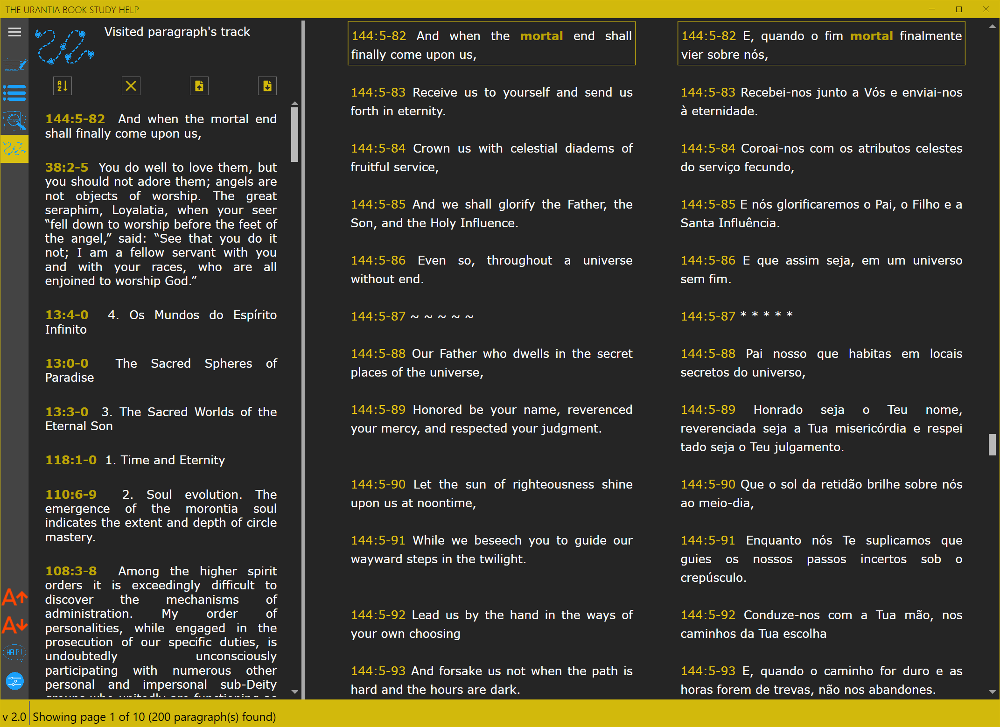
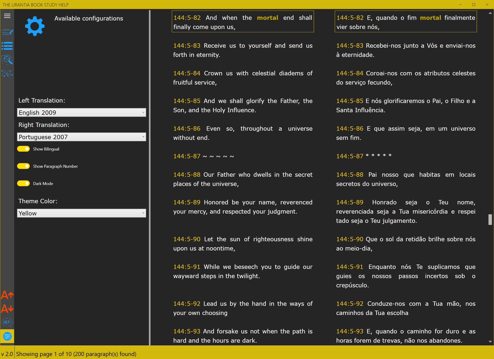

# UbStudyHelp - The Urantia Book Study Help

## Description:

This is a tool to help readers to learn and teach about The Urantia Book. Available translations:

English (original).
Portuguese 2007.

The tool is now in his first Alpha-Test, given only for some users to do a general testing in the several functionality. 

**For the release 2.0 we have**:

- **Table of contents**: clicking on any paper or section jumps to the equivalent text.
- **Index**: after typing at least 3 letters you get the index entries starting with those letters. Search's resources, as described below, are accepted.
- **Search Engine**: available for both translantions (when using bilingual text), the use of <a href="https://lucenenet.apache.org/" target="_blank">Lucene.net</a> tool give us several search options, as you can see [here](UbStudyHelpCore/UbStudyHelp/Pages/help.md)).  
- **Track**: keep a record from the last 50 paragraphs visited by using table of contents, index or search. They also can be saved to disk and restored when needed, creating a way to help studing the book

**Planned tools for some next release**:

- **Notes**: a way to take several notes from the book, connecting your observations with links to text. Notes will also be shareable, helping study groups.

- **Custom Studies**: import and execute search inside the contents of custom documents about, for example, history of Urantia papers, astronomy in the book or several numbers shown.

## Contents:

### Table of contents:

### Index:

### Search Engine:

### Track:

### Settings:

